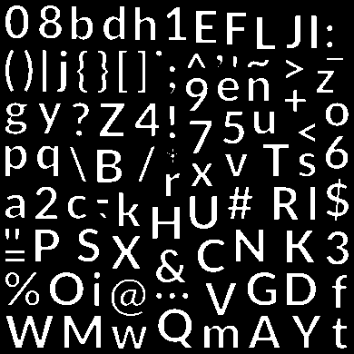
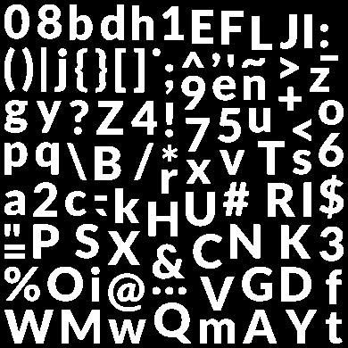
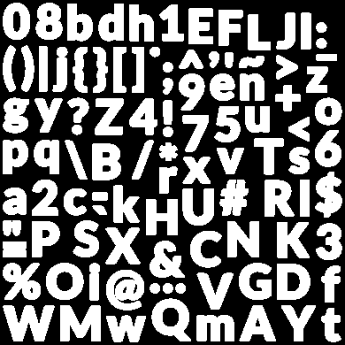
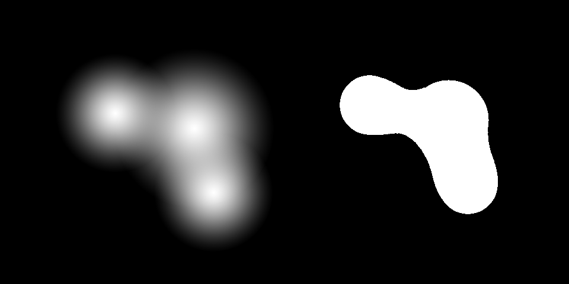

<!-- BEGIN ARISE ------------------------------
Title:: "2D Metaballs"

Author:: "Jose Falanga"
Description:: "Basic understanding of SDF ann Metaballs"
Language:: "en"
Published Date:: ""
Modified Date:: ""
---- END ARISE \\ DO NOT MODIFY THIS LINE ---->

# 2D Metaballs

Today I woke up thinking about procedural geometry. In particular, for terrain generation. In the past I did some experiments, and possibly I'm re-exploring them here just to formalize them. But I specifically want to explore 3D Metaballs. 

That's not what the title of this article says, isn't it? Correct, I will first explore the fundamentals behind just 2D Metaballs, and a later article will expand on the 3D analogues and possible applications. Why? Well, using 3D also has the complexity of procedural geometry, so I guess I prefer exploring the metaball complexity separately from that. Lame excuse, I know, but I want to keep this article short and full of pictures, so, roll with it.

## Understanding Metaballs
First place to look at is the [Wikipedia page](https://en.wikipedia.org/wiki/Metaballs) on the subject:

> In [computer graphics](https://en.wikipedia.org/wiki/Computer_graphics "Computer graphics"), **metaballs**, also known as **blobby objects**,[[1]](https://en.wikipedia.org/wiki/Metaballs#cite_note-1)[[2]](https://en.wikipedia.org/wiki/Metaballs#cite_note-2) are organic-looking _n_-dimensional [isosurfaces](https://en.wikipedia.org/wiki/Isosurface "Isosurface"), characterised by their ability to meld together when in close proximity to create single, contiguous objects.

Wikipedia also has great pictures:

So, these blobby objects are basically circular or spherical shapes (depending on how many dimensions you are going to handle) that get merged together in close vicinity, smoothly. It uses a threshold to determine if stuff is or is not part of the shape. Technically these are dots with some mass or radius, if they get close enough, that radius overlap turns into a "bridge" of sort between the two. Well, technically they can be more than 2, that's when stuff starts looking organic, but you get the idea.

One interesting thing to note, is that their "mass" is combined, so two balls of the same mass completely combined, should end in a bigger ball (I guess equivalent to the mass of both added up or something like that). 

Also, if any other properties exist in each ball, you could also merge them. In the picture, color is another thing that can gets merged. For the sake of simplicity, let's not do that.

## Signed Distance Fields

After reading a bit about this blobby friends, and the threshold thing, SDFs are the first thing that comes to me. It's a neat trick used basically for infinite resolution in many things. Text Mesh Pro uses it for [FontAssets](https://docs.unity3d.com/Packages/com.unity.textmeshpro@4.0/manual/FontAssets.html): 

If you apply a threshold function to that, you get these:

  

You get the idea, the gradient combined with the threshold define the font "boldness". The bigger the threshold, the more pixels are turned white. Let's see what happens if we do the same for circles. A quick Photopea idea shows we are into something:

So, it seems like points, turned into radial gradients, multiplied, and then having a threshold function applied looks promising. Let's try to implement it in Godot!
