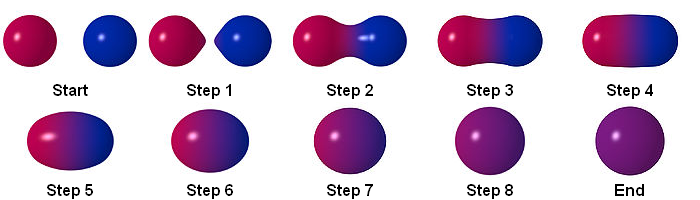
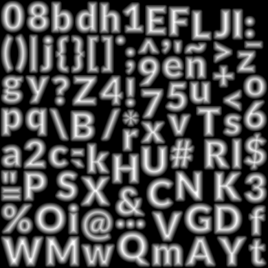
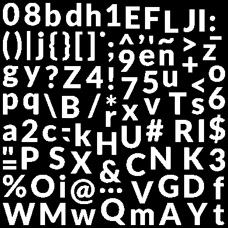
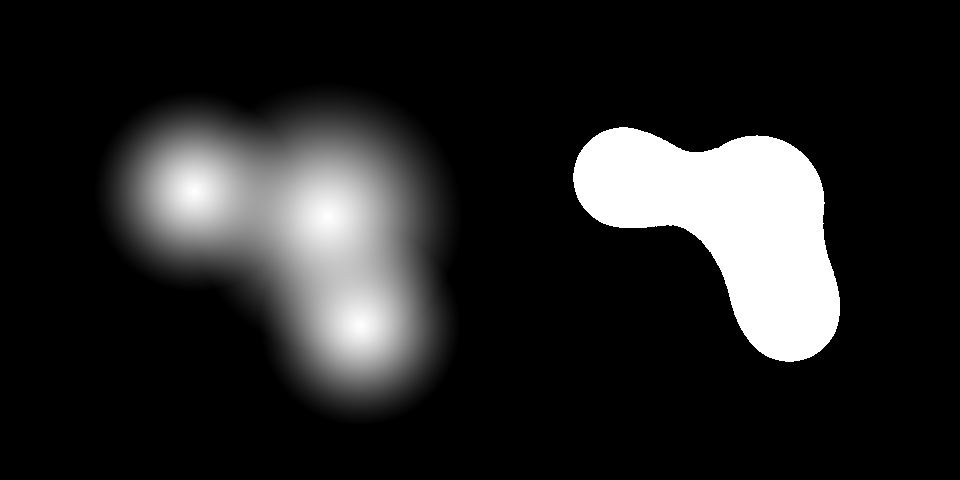
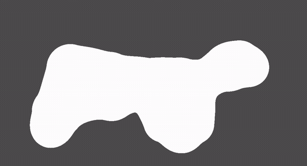

<!-- BEGIN ARISE ------------------------------
Title:: "2D Metaballs"

Author:: "Jose Falanga"
Description:: "Basic understanding of SDF and Metaballs"
Language:: "en"
Published Date:: "2026-08-14"
Modified Date:: "2026-08-14"
---- END ARISE \\ DO NOT MODIFY THIS LINE ---->

# 2D Metaballs

Today I woke up thinking about procedural geometry. In particular, for terrain generation. In the past I did some experiments, and possibly I'm re-exploring them here just to formalize them. But I specifically want to explore 3D Metaballs. 

That's not what the title of this article says, is it? Correct, I will first explore the fundamentals behind just 2D Metaballs, and a later article will expand on the 3D analogues and possible applications. Why? Well, using 3D also has the complexity of procedural geometry, so I guess I prefer exploring the metaball complexity separately from that. Lame excuse, I know, but I want to keep this article short and full of pictures, so, roll with it.

## Understanding Metaballs
First place to look at is the [Wikipedia page](https://en.wikipedia.org/wiki/Metaballs) on the subject:

> In [computer graphics](https://en.wikipedia.org/wiki/Computer_graphics "Computer graphics"), **metaballs**, also known as **blobby objects**,[[1]](https://en.wikipedia.org/wiki/Metaballs#cite_note-1)[[2]](https://en.wikipedia.org/wiki/Metaballs#cite_note-2) are organic-looking _n_-dimensional [isosurfaces](https://en.wikipedia.org/wiki/Isosurface "Isosurface"), characterised by their ability to meld together when in close proximity to create single, contiguous objects.

Wikipedia also has great pictures:



So, these blobby objects are basically circular or spherical shapes (depending on how many dimensions you are going to handle) that get merged together in close vicinity, smoothly. They use a threshold to determine if stuff is or is not part of the shape. Technically these are dots with some mass or radius, if they get close enough, that radius overlap turns into a "bridge" of sort between the two. Well, technically they can be more than 2, that's when stuff starts looking organic, but you get the idea.

One interesting thing to note is that their fields combine by simple addition. Two overlapping balls of the same strength form a single larger ball, but it won't be twice as big: the resulting size grows sub-linearly with the combined field.

Also, if any other properties exist in each ball, you could also merge them. In the picture, color is another thing that can get merged. For the sake of simplicity, let's not do that.

## Signed Distance Fields

After reading a bit about these blobby friends, and the threshold thing, SDFs are the first thing that comes to mind. It's a neat trick used basically for infinite resolution in many things. Text Mesh Pro uses it for [FontAssets](https://docs.unity3d.com/Packages/com.unity.textmeshpro@4.0/manual/FontAssets.html): 



If you apply a threshold function to that, you get this:



You get the idea, the gradient combined with the threshold defines the font "boldness". The bigger the threshold, the more pixels are turned white. Let's see what happens if we do the same for circles. A quick Photopea experiment shows we are into something:



So, the idea is promising: points turned into radial gradients, added together, and then having a threshold function applied.

The threshold is the magic number that decides how everything looks. Too high and the balls stay separate circles, too low and they all merge into a single blob. 

So, let's see how this looks implemented in Godot!


```
shader_type canvas_item;

// Every ball is packed in one vec3: .xy is its position (viewport pixels) and
// .z is its radius. Godot hands us the array every frame, and active_balls
// says how many slots are really alive so dead ones cost nothing.
uniform vec3 balls[16];
uniform int active_balls = 0;

// The magic number!
uniform float threshold : hint_range(0.0, 1.0) = 0.5;

void fragment() {
	// FRAGCOORD.xy is the pixel we're drawing right now, in viewport coordinates.
	vec2 pos = FRAGCOORD.xy;

	// Add the pull of every ball on this pixel. That sum is our field, the same
	// idea as the radial gradients added together in the Photopea experiment.
	float field = 0.0;
	for (int i = 0; i < active_balls; i++) {
		float r = balls[i].z;
		vec2 to_ball = pos - balls[i].xy;
		float d2 = dot(to_ball, to_ball);

		// Outside the ball's radius there's nothing to add, so skip ahead and
		// save the division below. This is the check that keeps far balls cheap.
		if (d2 >= r * r)
			continue;

		// This is where we construct how the gradient looks. The classic 
		// metaball falloff is: 1 at the center, smoothly dying to 0 at the
		// ball's edge. Squaring it twice gives that organic look where close
		// balls "bridge" into each other instead of just overlapping.
		float t = max(0.0, 1.0 - d2 / (r * r));
		field += t * t;
	}

	// Threshold time. step() returns 1 when the field clears the threshold, 0
	// otherwise, so blobs come out white and everything else transparent.
	float alpha = step(threshold, field);
	COLOR = vec4(vec3(alpha), alpha);
}

```

Having some GDScript to control it (handing over the position and radius every frame, so we have movement) looks like this:



> Hypnotic, isn't it? Very lava-lampy.

As for how many balls we can have, that's mostly a matter of how much work we ask the GPU to do. The shader renders the whole screen, pixel by pixel, and every pixel has to visit every ball to sum its influence. So the cost grows with the maximum number of balls we allow, whether they are alive or not. In my implementation I capped it at 16, which is nothing for a modern GPU, but the number is just a constant we can crank up if we ever need more blobs. Beyond 128, it might be a good idea to do it in two steps: first generating the gradient map (from particles, another shader, scene objects being blurred, whatever you can imagine), and then applying the threshold function to it. Same principle applies.

Now that we have a nice blob like this, we could add more things on top of it! Stay tuned for the next article, where I will just ramble through iterations of this shader until it looks trippy!
