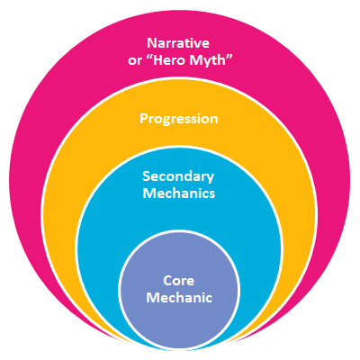
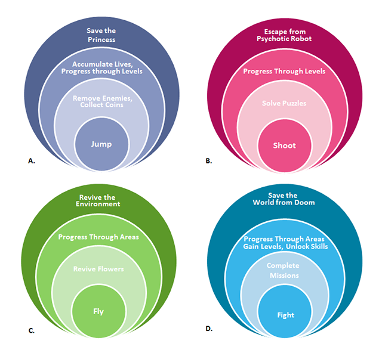

<!-- BEGIN ARISE ------------------------------
Title:: "Designing around a core mechanic"

Author:: "Charmie Kim"
Description:: "It's easy to plug game mechanics into your game design, but it's not always obvious whether those mechanics suit your game. Here's a simple framework to help you understand and evaluate your design from the core out."
Language:: "en"
Thumbnail:: "arise-icon.png"
Published Date:: "2012-07-06"
Modified Date:: "2026-09-13"
content_header:: "true"
rss_hide:: "false"
---- END ARISE \\ DO NOT MODIFY THIS LINE ---->

> Originally published by Charmie Kim at the now defunct [Funstorm Games blog](https://web.archive.org/web/20150317162320/http://www.funstormgames.com/blog/2012/06/designing-around-a-core-mechanic/). Then reposted to [Gamasutra](https://web.archive.org/web/20120630131425/http://www.gamasutra.com/blogs/CharmieKim/20120612/172238/Designing_around_a_core_mechanic.php), where I originally read it, and it kinda stuck with me since. That one survives at [GameDeveloper](https://www.gamedeveloper.com/design/designing-around-a-core-mechanic), but it no longer has pictures, so I'm reposting the original Funstorm text here.

In our wild wild game design world every designer is likely to have their own shade of design methodology, lack thereof being a kind of methodology of its own. I’d like to share a bit of mine.

When I was still a game design student in Vancouver, I was taught this life-changing design tool by [Wil Mozell](https://www.mobygames.com/person/31723/william-m-mozell/) - I don’t mean to name drop, I just owe a lot to this guy – over lunch at a White Spot. At least one mind was blown in that generic family-style restaurant that day. I’ve been whipping this tool out to evaluate every bit of game design I do ever since. Trust  me, it’s amazing.  
The tool is a deceptively simple diagram that I call the ‘Core Diagram’:

In this model, the core mechanic is at the very center and forms a nucleus for your game. The other mechanics form layers around the core, with the narrative forming the very outer layer.

Theory-crafting game designers love to define words, as do I, so let’s not skip that bit! By **mechanic** I mean a system that facilitates interaction, and by **interaction** I mean a kind of conversation between the player and the game. Neither of these words actually amount to what games actually are, because a game is the **experience** generated by those words when they get put in a disco with the player’s brain and circumstance. However, until we invent neuro-technology that can transfer experiences directly from one brain to another, what us game designers can control within this dance are the mechanics. The mechanics are the paint and paintbrush, the nail and hammer, the two girls and cup of our art!

But still, it’s probably not very clear what exactly is a ‘Core’ mechanic in a game.  Easiest way to understand it, I think, is in relation to time.

- The **core mechanic** in a game will usually be the _purposeful interaction_ that occurs the most _frequently_. In a platforming game, this is usually jumping. In a shooter, it is usually shooting. In a racing game, it will be driving. Another way to determine the core mechanic is, if without it, you wouldn’t be able to play the game at all.
- The **secondary mechanics** are the interactions that happen less frequently. They could even be layered out from more frequent to least frequent.
- **Progression** systems form the mechanical envelope of the game, being the source of change within the game system at a holistic level.
- The **Narrative** layer is the outer most layer that puts all the inner layers within it into context.

# **Gameplay Innovation**

Now that you understand the model, could you guess which games each of these core diagrams represent?

The answers are:  
A. Super Mario Bros.  
B. Portal  
C. Flower  
D. Every fantasy RPG ever made :)

There are some qualitative observations that can be made immediately, just from looking at these examples.

- The best games usually have a very strong core mechanic that is easy to grasp but provides room to expand upon. It also helps if the mechanic has a powerful meaning to it of its own – there’s a good reason why shooting is such a popular core mechanic in our field.

- The most effective games are ones where each layer compliments the other. You can test the relationship between the layers by seeing what effect each layer has on the other. i.e. “In order to remove enemies, I must jump, and in order to progress through levels, I must remove enemies.” If your layers don’t have this kind of gating relationship going outward, and contextual relationship going inward, you may want to re-consider your design!

- Truly fresh experiences often result from innovations at the core of the game. For example, Flower is to this day one of my most memorable game experiences because I’d never played a game that made me feel so much like I was flying in the wind. It had an unusual core mechanic, and it did that mechanic extremely well.

- Sometimes innovation comes from having an unusual combination of layers, for example, the shooting core mechanic won’t normally be paired with solving puzzles. But Portal did it, and did it well.  
    Also consider how Portal differs from shooter games that have puzzles on the side (puzzles that do not use the shooting mechanic in order to solve them), and how effective those experiences are in comparison.

- Some combinations of mechanics are truly timeless, such as D. It’s like a classic dish in French cuisine – it tastes good, and it’s hard to mess with.

# **Mobile and Social**

In the last year or so I started looking at social and mobile games in this light, and again, it’s really fascinating to see how they map.

Let’s play guess the game again! Ready?  
A. Angry Birds  
B. CityVille  
Now some more observations!

- The biggest shift in design caused by new platforms and audiences are in the Core and the Narrative layers. Removing pigs is no different from removing mushrooms, and completion or unlocking mechanics have always been staples in progression design. This is really interesting to me because I understand it to mean that the Core shifts mostly with new interfaces or platforms, like the touch screen, while Narratives shift because of the different players that the games target. But otherwise, game design is still game design!

- Angry Birds is an awkwardly designed game. Flinging relates to removing pigs, but the relationship is indirect, and sometimes feels arbitrary, even. This also makes relating flinging to completing levels rather awkward. You know that strange feeling you get in an Angry Birds level where you have that one pig off to the side that you can’t seem to get, and you’re madly playing fling trial-and-error to get it? Yea, it gets a little awkward, and not fun! Something else that gets left out in this diagram is the points system, it just doesn’t fit very well with the other layers. Removing pigs gets you points but you have to remove them anyway so it’s redundant, and the points are needed to complete the levels but in an entirely arbitrary way!  Every game designer in the world has their own opinion on how Angry Birds got to be so big, but I think I have proof here that it ain’t the design ;D

- In comparison, CityVille is amazingly elegant within the inner 3 layers. Look how tightly collecting currency weaves into buying buildings, and collecting XP weaves into unlocking buildings, which weaves back into buying buildings, and then again, weaves back into collecting from them. Beautiful! But, there is still a weakness, and it’s a big one. Exactly how does clicking buildings to collect from them (it’s not even made very clear that they are supposed to be taxes) and unlocking buildings (again, messaged in a very ‘game-y’ way with buildings unlocking at every level) make you a better mayor? CityVille could do well with some tweaks in how it integrates its overall narrative.

- I don’t have a diagram here for all the Zynga games but my biggest beef with them is that almost every one of their virtual world games (other than their newer Indiana Jones game and the hidden object game) have the same 3 inner layers – collect/harvest, buy stuff, unlock stuff. It’s like they know how good it is and they wanted to explore that same design until noone wanted to play it anymore. :)

I haven’t tackled how social/multiplayer fits into all this, that would be a post of its own. But a good measure to go by is, a truly social game would require more than one player involved at each of the layers. If I were to make a Zynga game more social, for example, I would make collecting an activity done with friends (this is already the case), buying buildings would be in relation to friends (for example, if I buy the Fashion Design Studio building and you buy the Clothing Boutique building, I could supply you with clothes for your building and we could split profits, right?) etc. Is it any wonder MMO games like WoW are so powerful? They take the classic RPG formula and apply social dynamics every step of the way.

# **Strategy Games a.k.a. The Slow Core**

The core mechanics I’ve looked at in other games so far have a physical ‘fun’ to it on its own. A good designer working on a platformer would pay a lot of attention to the physics of a single jump so that the core activity feels good even without the secondary mechanics or progression. Yet, it would be a mistake to think that every core mechanic needs to have such a twitchy tight singular loop. Looking at strategic games, for example, the core mechanic is often ‘unit placement’. Physically speaking, there’s nothing innately joyful about placing a unit in a strategy game, but look at it as a cerebral activity and it sheds light on how deep and meaningful this core mechanic can be and why strategy games are so much fun. Note also that with strategy games, the core mechanic is far more complex and involves lots of different feedback loops within it. In other words, there’s a lot more information being processed within the interaction right in the core!

# **Multiple Cores and Modal Shifts**

I would also add a caveat here and say that not all games fit this mould so well, and those are some of the most fun. Many successful games do modal shifts where you go from one core diagram to another. This works really well, I think, if one set of mechanics is more twitch and the other more relaxed, and the modal shift is used for pacing. A great example of this is one of my favourite game franchises of all time, Mass Effect!

I hope this tool is as inspiring for you as it has been for me, at the very least I hope you find the musings interesting. Try mapping some of your favourite games and see what the diagram can teach you through them. Are there any games that really don’t map at all? Let me know!