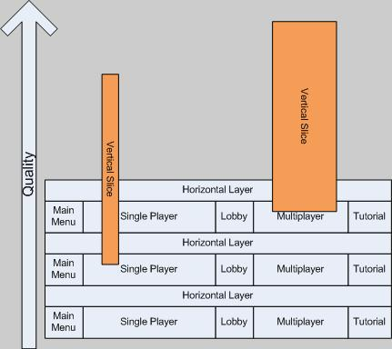

<!-- BEGIN ARISE ------------------------------
Title:: "Vertical Slice vs. Horizontal Layer"

Author:: "Uber Entertainment"
Description:: "Vertical Slice vs. Horizontal Layer"
Language:: "en"
Thumbnail:: "arise-icon.png"
Published Date:: "2009-04-16"
Modified Date:: "2025-10-13"
content_header:: "true"
rss_hide:: "false"
---- END ARISE \\ DO NOT MODIFY THIS LINE ---->

# Vertical Slice vs. Horizontal Layer

> Originally posted in the now defunct uber.typepad.com blog. You can find an archived version on [The Internet Archive](https://web.archive.org/web/20250914133730/https://uber.typepad.com/birthofagame/2009/04/vertical-slice-vs-horizontal-layer.html)

I've [mentioned before](../find-the-fun) [(archive)](https://web.archive.org/web/20250914133730/https://uber.typepad.com/birthofagame/2008/10/find-the-fun-fi.html) I think the Vertical Slice (VS) is one of the most abused industry practices. By definition, it ought to be a version of your software that is near final quality in a small subset of its domain that represents the overall product. If you're making Call of Duty 4 it might be "just one mission" complete with working AI controlled enemies, HUD art, polished control scheme, in-mission cinematics, and near final quality art assets. The problem is getting to this vertical slice actually requires completing a huge portion of the game. For example, the subset of character rigs and animations required for the level may be 80% of the animations needed for the entire game. The UI and HUD are an often underestimated amount of work yet having near final quality versions of them for "just one mission" is saying that entire subsystem needs to be nearly complete. The requirements may say 3 weapons out of the 15 that will be in game, but you'll be doing more than 1/5th of the code underneath to meet those requirements. If employed too early in development the VS can derail an entire project or worse put it on the fast track to nowhere.

So when is the appropriate time to build a Vertical Slice? I say after the few Horizontal Layer iterations are complete. What's a Horizontal Layer? Glad you asked. When we prototype at Uber, we prototype the entire game from beginning to end. This includes single player, multiplayer, main menus, option screens, cinematics, mission briefings, etc. When the entire experience is laid out in whitebox form, that is with temporary art assets and most likely temporary code, we call that a Horizontal Layer (HL). This gives us the best sense of the actual work required to complete the game, and the iteration on the HL creates a breeding ground of creativity as trying out new ideas is quick and inexpensive.

Now, you and I well know in the real world there are often constraints and external forces that result in a VS being embarked upon before the entire game has been covered with HLs. This can work though if properly planned and there has been at least a couple of HL iterations laid in the specific area the VS is targeting. In fact this is exactly what we recently did on our current project. We built an HL for just the core MP game experience, and after several iterations on that decided to go for a VS with a subset of the content. This allowed us to put together a really kick ass gameplay video that we showed off, in private, at GDC.

My diagram-fu is weakened when working on my laptop’s track-pad, but the diagram below still serves to illustrate a few key points.

First, components of the game (Single Player, Tutorial, etc) differ in the amount of work and are so represented by different width blocks. As each HL is complete quality goes up. The VS sits on top of the HL and therefore is elevated in quality by it. In this diagram two vertical slices are created for two different portions of the game; single player and multiplayer. You can see that the slices themselves are of different widths. This represents the amount of the component the VS is meant to demonstrate. For example the single player VS may only be showing off one portion of one campaign mission, whereas the multiplayer VS might be demonstrating nearly fully functional gameplay on a variety of maps. Also note that each slice was started during a different HL iteration. Had the VS for single player began on the 3rd HL iteration it would have achieved a higher quality level.

Our focus now is on laying Horizontal Layers for the rest of the game, which can be broken up into several distinct segments. After iterating upon these layers several time we’ll go vertical, possibly on multiple ones simultaneously.

To summarize, the Vertical Slice is a useful tool when employed in a controlled manner at the right time for the software, but can be disastrous if executed in contrary conditions. Here’s a rule of thumb: **Iterate on an Horizontal Layer that covers the desired areas of the game at least 3 times before taking on the Vertical Slice**.