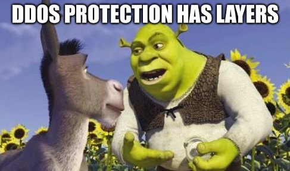

<!-- BEGIN ARISE ------------------------------
Title:: "Hardening against DDoS"

Author:: "Jose Falanga"
Description:: "Homebrew strong L3, L4, and L7 DDoS protection"
Language:: "en"
Published Date:: "2025-11-19"
Modified Date:: "2022-11-19"
content_header:: "true"
rss_hide:: "false"
---- END ARISE \\ DO NOT MODIFY THIS LINE ---->

# Hardening against DDoS

We already explored in [this previous post](../caddy-fail2ban/) ways to harden against common threats and bots targeting our public servers. We used the strategy of banning IPs if certain amount of failed requests was met, in the range of the `4xx`. 

However, what if the attackers employ valid `2xx` status requests as the attack vector? We can totally harden our server to deal with that too. We will setup **four complementary layers** that each stop different types of attacks at different stages of the network stack.

In the config files used here, there is various settings you can tune for your use cases. Take that into consideration if your services actually expect more traffic per IP than these defaults.

## Why All Four Are Needed

Each layer handles threats that the others cannot:

1.  **Kernel** filters malicious packets *before* they reach the firewall.
2.  **Firewall** limits abusive connection rates at the network layer.
3.  **Fail2ban**  blocks attackers who make valid HTTP requests but abuse them.
4.  **Caddy** rate-limits or blocks excessive HTTP traffic directly at the web server before it reaches the application.

Together they provide strong L3, L4, and L7 DDoS protection. As usual, this can be expanded an you can even have an extra layer on top, like Cloudflare, but is a good introduction to these topics.



## 1. Kernel Hardening

Improves TCP resilience, handles malformed traffic, and enables a modern congestion algorithm.

**Threat addressed:**
Low-level floods and malformed packets attempting to overwhelm the network stack.

Edit:

``` bash
sudo nano /etc/sysctl.conf
```

Add:

``` bash
net.ipv4.tcp_syncookies = 1
net.netfilter.nf_conntrack_max = 262144
net.ipv4.tcp_invalid_ratelimit = 500
net.core.default_qdisc = fq
net.ipv4.tcp_congestion_control = bbr
```

Apply:

``` bash
sudo sysctl -p
```

## 2. Firewall Hardening

Implements per-IP rate limiting for TCP handshakes and blocks UDP floods.

**Threat addressed:**
High-volume L3/L4 attacks (SYN floods, UDP floods, connection-rate floods).

Edit:

``` bash
sudo nano /etc/nftables.conf
```

This is what the defaults looks like:

``` bash
#!/usr/sbin/nft -f

flush ruleset

table inet filter {
        chain input {
                type filter hook input priority 0;
        }

        chain forward {
                type filter hook forward priority 0;
        }

        chain output {
                type filter hook output priority 0;
        }
}

```

Inside the `chain input` block, add:

``` bash
# SYN Flood Protection
tcp dport {80,443} flags syn meter ddos_syn { ip saddr limit rate 20/second burst 40 packets } accept
tcp dport {80,443} flags syn drop

# Drop UDP on web ports
udp dport {80,443} drop
```

So it looks like this:

``` bash                                                                                               
#!/usr/sbin/nft -f

flush ruleset

table inet filter {
        chain input {
                type filter hook input priority 0;

                # SYN Flood Protection
                tcp dport {80,443} flags syn meter ddos_syn { ip saddr limit rate 20/second burst 40 packets } accept
                tcp dport {80,443} flags syn drop

                # Drop UDP on web ports
                udp dport {80,443} drop
        }

        chain forward {
                type filter hook forward priority 0;
        }

        chain output {
                type filter hook output priority 0;
        }
}
```

Apply:

``` bash
sudo nft -f /etc/nftables.conf
```

## 3. Fail2ban HTTP Flood Protection

Blocks clients generating excessive HTTP requests in a short window.

**Threat addressed:**
L7 abuse such as GET/POST floods, aggressive scanning, scraping.

### Jail

Edit:

```bash
sudo nano /etc/fail2ban/jail.d/http-get-flood.conf
```

Contents:

``` ini
[http-get-flood]
enabled  = true
port     = http,https
logpath  = /var/log/caddy/access.log
filter   = http-get-flood
maxretry = 120
findtime = 10
bantime  = 3600
```

**Meaning:** If an IP makes **120 requests in 10 seconds**, it gets banned for **1 hour**.

### Filter

Edit:

```bash
sudo nano /etc/fail2ban/filter.d/http-get-flood.conf
```

Contents:

```bash
[Definition]
failregex = ^<HOST> -.*"(GET|POST|HEAD) .*
```

Restart:

``` bash
sudo systemctl restart fail2ban
```

## 4. Caddy Fingerprinting & Flood Protection

Removes identifying headers, hides error pages, and adds local flood protection.

**Threat addressed:**
L7 fingerprinting, reconnaissance, and excessive request bursts hitting Caddy directly.

Edit:

``` bash
sudo nano Caddyfile
```

Define this template at the top:

``` bash
(fingerprint_protection) {
    header {
        -Server
        -X-Powered-By
        -Via
        -X-Response-Time-Ms
        -Transfermode.dlna.org
        -Realtimeinfo.dlna.org
    }

    handle_errors {
        respond "An error occurred." 500
    }
}
```

Import it on every block you want protected:

``` bash
example.thergic.ar {
    import fingerprint_protection
    reverse_proxy localhost:1234
    ...
}
```

Reload:

``` bash
sudo systemctl restart caddy
```

## Final words

This guide is meant for learning how hardening a self-hosted VM or home lab works. These layers will protect you from bottom-feeders attacking your exposed homebrew services. 

Actual commercial services available to the general public, with a lot more traffic will be far more exposed and I recommend you using another layer on top of all this to prevent other DDoS attacks. While all these layers might mitigate the effects of most threats, some large scale attacks using botnets with a lot of IPs will still hurt you and make your services unavailable or use up your resources.

Be careful on what you are exposing to the public. Have a good backup policy. Thread safely. Good luck!