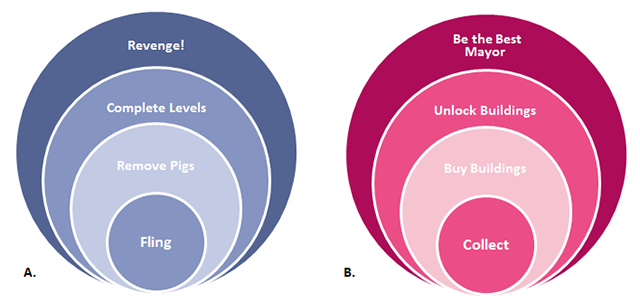

<!-- BEGIN ARISE ------------------------------
Title:: "Diseñando alrededor de una mecánica central"

Author:: "Charmie Kim"
Description:: "Es fácil agregar mecánicas de juego a tu diseño, pero no siempre es obvio si esas mecánicas le sientan bien a tu juego. Aquí tenés un marco simple para ayudarte a entender y evaluar tu diseño desde el núcleo hacia afuera."
Language:: "es"
Thumbnail:: "arise-icon.png"
Published Date:: "2012-07-06"
Modified Date:: "2026-09-13"
content_header:: "true"
rss_hide:: "false"
---- END ARISE \\ DO NOT MODIFY THIS LINE ---->

# Diseñando alrededor de una mecánica central

> Originalmente publicado por Charmie Kim en el ahora desaparecido [blog de Funstorm Games](https://web.archive.org/web/20150317162320/http://www.funstormgames.com/blog/2012/06/designing-around-a-core-mechanic/). Luego republicado en [Gamasutra](https://web.archive.org/web/20120630131425/http://www.gamasutra.com/blogs/CharmieKim/20120612/172238/Designing_around_a_core_mechanic.php), donde lo leí originalmente, y se me quedó pegado desde entonces. Ese sobrevive en [GameDeveloper](https://www.gamedeveloper.com/design/designing-around-a-core-mechanic), pero ya no tiene imágenes, así que estoy republicando acá el texto original de Funstorm.

En nuestro salvaje, salvaje mundo del diseño de juegos, es probable que cada diseñador tenga su propia tonalidad de metodología de diseño, siendo la falta de ésta un tipo de metodología propio. Me gustaría compartir un poquito de la mía.

Cuando todavía era estudiante de diseño de juegos en Vancouver, me enseñó esta herramienta de diseño que cambia vidas [Wil Mozell](https://www.mobygames.com/person/31723/william-m-mozell/) - no es por presumir, simplemente le debo mucho a este tipo – durante un almuerzo en un White Spot. Al menos una mente explotó en ese genérico restaurante familiar ese día. Desde entonces, he estado sacando esta herramienta para evaluar cada pedacito de diseño de juegos que hago. Confía  en mí, es asombrosa.  
La herramienta es un diagrama engañosamente simple que llamo el 'Diagrama Núcleo':

En este modelo, la mecánica central está justo en el centro y forma un núcleo para tu juego. Las otras mecánicas forman capas alrededor del núcleo, con la narrativa formando la capa más externa.

A los diseñadores que teorizan les encanta definir palabras, a mí también, ¡así que no nos salteemos esa parte! Por **mecánica** me refiero a un sistema que facilita la interacción, y por **interacción** me refiero a un tipo de conversación entre el jugador y el juego. Ninguna de estas palabras realmente equivale a lo que los juegos son, porque un juego es la **experiencia** generada por esas palabras cuando se las mete en un boliche con el cerebro y las circunstancias del jugador. Sin embargo, hasta que inventemos neuro-tecnología que pueda transferir experiencias directamente de un cerebro a otro, lo que nosotros los diseñadores podemos controlar dentro de este baile son las mecánicas. Las mecánicas son la pintura y el pincel, el clavo y el martillo, las dos chicas y el vaso de nuestro arte.

Pero aún así, probablemente no queda muy claro qué es exactamente una mecánica 'central' en un juego. La forma más fácil de entenderlo, creo, es en relación al tiempo.

- La **mecánica central** de un juego suele ser la interacción _con propósito_ que ocurre con mayor _frecuencia_. En un juego de plataformas, suele ser saltar. En un shooter, disparar. En un juego de carreras, conducir. Otra forma de determinar la mecánica central es si, sin ella, no podrías jugar el juego en absoluto.
- Las **mecánicas secundarias** son las interacciones que ocurren con menos frecuencia. Incluso podrían disponerse en capas, de la más frecuente a la menos frecuente.
- Los sistemas de **Progresión** forman la envolvente mecánica del juego, siendo la fuente de cambio dentro del sistema de juego a un nivel holístico.
- La capa de **Narrativa** es la capa más externa, que pone en contexto a todas las capas internas.

## Innovación en el Gameplay

Ahora que entendés el modelo, ¿podés adivinar a qué juegos representa cada uno de estos diagramas núcleo?

Las respuestas son:  
A. Super Mario Bros.  
B. Portal  
C. Flower  
D. Todo RPG de fantasía jamás hecho :)

Hay algunas observaciones cualitativas que se pueden hacer de inmediato, sólo con mirar estos ejemplos.

- Los mejores juegos suelen tener una mecánica central muy fuerte, fácil de entender pero con espacio para expandirse. También ayuda si la mecánica tiene un significado poderoso propio – hay una buena razón por la cual disparar es una mecánica central tan popular en nuestro campo.

- Los juegos más efectivos son aquellos donde cada capa complementa a la otra. Podés probar la relación entre las capas viendo qué efecto tiene cada capa sobre la otra. P.ej. "Para eliminar enemigos, debo saltar, y para progresar a través de los niveles, debo eliminar enemigos." Si tus capas no tienen este tipo de relación de bloqueo hacia afuera, y de relación contextual hacia adentro, ¡quizás quieras reconsiderar tu diseño!

- Las experiencias realmente frescas a menudo resultan de innovaciones en el núcleo del juego. Por ejemplo, Flower es hasta el día de hoy una de mis experiencias de juego más memorables porque nunca había jugado un juego que me hiciera sentir tanto que estaba volando en el viento. Tenía una mecánica central inusual, y ejecutaba esa mecánica extremadamente bien.

- A veces la innovación viene de tener una combinación inusual de capas. Por ejemplo, la mecánica central de disparar normalmente no se combina con resolver puzzles. Pero Portal lo hizo, y lo hizo bien.  
    Considerá también cómo Portal difiere de los shooters que tienen puzzles al costado (puzzles que no usan la mecánica de disparar para resolverse), y qué tan efectivas son esas experiencias en comparación.

- Algunas combinaciones de mecánicas son realmente atemporales, como la D. Es como un plato clásico de la cocina francesa – sabe bien, y es difícil de estropear.

## Móvil y Social

En el último año más o menos empecé a mirar los juegos sociales y móviles bajo esta luz, y de nuevo, es realmente fascinante ver cómo mapean.

¡Juguemos a adivinar el juego otra vez! ¿Listo?  
A. Angry Birds  
B. CityVille  
¡Ahora algunas observaciones más!

- El cambio más grande en el diseño causado por las nuevas plataformas y audiencias está en las capas del Núcleo y la Narrativa. Remover cerdos no es diferente de remover champiñones, y las mecánicas de completado o desbloqueo siempre han sido alimentos básicos del diseño de progresión. Esto es realmente interesante para mí porque lo entiendo como que el Núcleo cambia sobre todo con las nuevas interfaces o plataformas, como la pantalla táctil, mientras que las Narrativas cambian por los distintos jugadores a los que apuntan los juegos. Pero fuera de eso, ¡el diseño de juegos sigue siendo diseño de juegos!

- Angry Birds es un juego diseñado torpemente. Lanzar pájaros se relaciona con remover cerdos, pero la relación es indirecta, y a veces hasta se siente arbitraria. Esto también hace que relacionar el lanzamiento con completar niveles sea bastante torpe. ¿Conocés esa sensación rara en un nivel de Angry Birds donde hay un cerdo al costado que parece que no podés eliminar, y estás locamente jugando a prueba y error con lanzamientos para eliminarlo? Sí, se pone un poco torpe, ¡y nada divertido! Otra cosa que queda afuera en este diagrama es el sistema de puntos; simplemente no encaja muy bien con las otras capas. Remover cerdos te da puntos, pero tenés que removerlos igual, así que es redundante, y los puntos se necesitan para completar los niveles pero de una manera totalmente arbitraria. ¡Todos los diseñadores de juegos del mundo tienen su opinión sobre cómo Angry Birds llegó a ser tan grande, pero creo que tengo aquí la prueba de que no es por el diseño ;D

- En comparación, CityVille es asombrosamente elegante dentro de las 3 capas internas. Mirá qué tan estrechamente se entreteje el recolectar monedas con comprar edificios, y el recolectar XP con desbloquear edificios, que se entreteje de vuelta con comprar edificios, y después otra vez, con recolectar de ellos. ¡Hermoso! Pero aún hay una debilidad, y es grande. ¿Exactamente cómo te hace mejor alcalde el hacer clic en los edificios para recolectar (ni siquiera queda muy claro que se supone que son impuestos) y el desbloquear edificios (de nuevo, comunicado de una manera muy 'game-y', con edificios que se desbloquean en cada nivel)? A CityVille le vendrían bien algunos ajustes en cómo integra su narrativa general.

- No tengo un diagrama acá para todos los juegos de Zynga, pero mi mayor queja con ellos es que casi todos sus juegos de mundos virtuales (salvo su juego más nuevo de Indiana Jones y el de objetos ocultos) tienen las mismas 3 capas internas – recolectar/cosechar, comprar cosas, desbloquear cosas. Es como si supieran lo bueno que es y quisieran explorar ese mismo diseño hasta que nadie quisiera jugarlo más. :)

No he abordado cómo encaja lo social/multijugador en todo esto; eso sería un post en sí mismo. Pero una buena medida para guiarse es que un juego verdaderamente social requeriría más de un jugador involucrado en cada una de las capas. Si yo hiciera un juego de Zynga más social, por ejemplo, haría de la recolección una actividad hecha con amigos (esto ya es el caso), la compra de edificios estaría en relación con los amigos (por ejemplo, si yo compro el edificio del Estudio de Diseño de Moda y vos comprás la Boutique de Ropa, yo podría proveerte de ropa para tu edificio y podríamos dividir las ganancias, ¿no?) etc. ¿Es de extrañar que los MMO como WoW sean tan poderosos? Toman la fórmula clásica del RPG y le aplican dinámicas sociales en cada paso del camino.

## Juegos de Estrategia a.k.a. El Núcleo Lento

Las mecánicas centrales que he visto en otros juegos hasta ahora tienen un 'divertido' físico por sí solas. Un buen diseñador trabajando en un plataformero prestaría mucha atención a la física de un solo salto para que la actividad central se sienta bien incluso sin las mecánicas secundarias o la progresión. Aún así, sería un error pensar que toda mecánica central necesita un bucle único tan nervioso y apretado. Mirando los juegos de estrategia, por ejemplo, la mecánica central suele ser la 'colocación de unidades'. Físicamente hablando, no hay nada inherentemente alegre en colocar una unidad en un juego de estrategia, pero míralo como una actividad cerebral y arroja luz sobre qué tan profunda y significativa puede ser esta mecánica central y por qué los juegos de estrategia son tan divertidos. Notá también que en los juegos de estrategia, la mecánica central es mucho más compleja e involucra muchos bucles de retroalimentación diferentes dentro de ella. En otras palabras, hay mucha más información procesándose dentro de la interacción justo en el núcleo.

## Múltiples Núcleos y Cambios Modales

También agregaría una advertencia acá y diría que no todos los juegos encajan tan bien en este molde, y esos son algunos de los más divertidos. Muchos juegos exitosos hacen cambios modales donde pasás de un diagrama núcleo a otro. Esto funciona muy bien, creo, si un conjunto de mecánicas es más nervioso y el otro más relajado, y el cambio modal se usa para el ritmo. Un gran ejemplo de esto es una de mis franquicias favoritas de todos los tiempos, ¡Mass Effect!

Espero que esta herramienta sea tan inspiradora para vos como lo ha sido para mí; al menos espero que las reflexiones te resulten interesantes. Intentá mapear algunos de tus juegos favoritos y mirá qué puede enseñarte el diagrama a través de ellos. ¿Hay algún juego que realmente no mapee en absoluto? ¡Dejámelo saber!