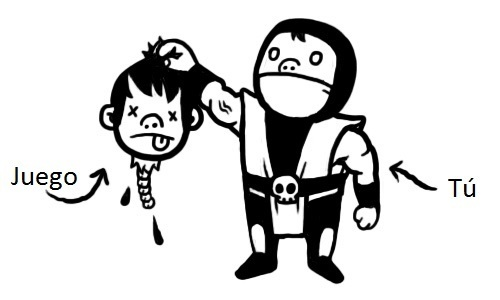
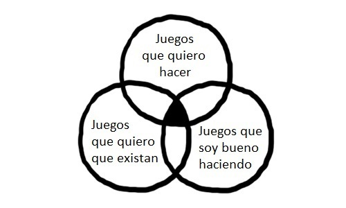
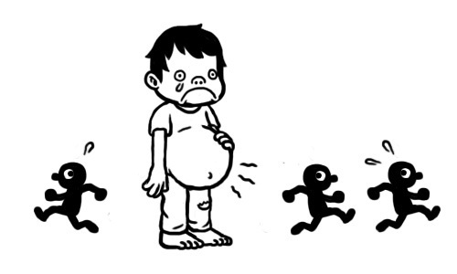
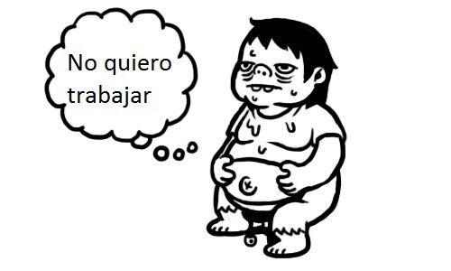
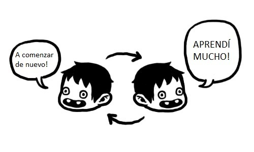
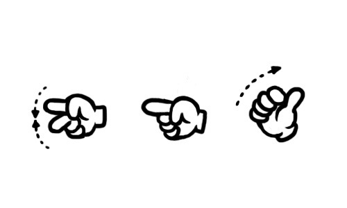
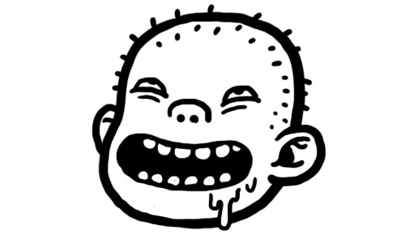

<!-- BEGIN ARISE ------------------------------
Title:: "Terminando un juego"

Author:: "Derek Yu, Fabio Panettieri"
Description:: "Terminando un juego"
Language:: "es"
Thumbnail:: "arise-icon.png"
Published Date:: "2010-09-17"
Modified Date:: "2025-11-03"
content_header:: "true"
rss_hide:: "false"
---- END ARISE \\ DO NOT MODIFY THIS LINE ---->
# Terminando un juego

> Original: [Finishing a Game](https://makegames.tumblr.com/post/1136623767/finishing-a-game) ([Archivo](https://web.archive.org/web/20100920055322/https://makegames.tumblr.com/post/1136623767/finishing-a-game)), por [Derek Yu](http://www.derekyu.com/). Traduccion originalmente publicada por Fabio Panettieri en Gaming Foundue.

_Por Derek Yu_  

Mientras trabajaba en completar mi [propio juego](http://spelunkyworld.com/), estuve pensando mucho acerca de terminar proyectos en general. Noté que hay un montón de desarrolladores realmente talentosos allí afuera que tienen problemas terminando juegos. A decir verdad, yo he dejado una larga cola de juegos sin terminar en mi camino. Creo que todos lo han hecho. No todo proyecto va a salir, sea cual fuere la razón. Pero si te encuentras constantemente abandonando proyectos que tienen mucho potencial, puede ser necesario tomar un paso hacia atrás y examinar por qué ésto sucede.

Todos hemos tenido ese sentimiento sobre al menos un juego, cómic, película, etc., que dice _‘Uh, yo podría hacerlo mejor. Ésto está sobre valorado.’_ Pero es importante retroceder y tomar en cuenta que, hey, pusieron su tiempo en terminar un proyecto, y yo no. ¡Esa es al menos una cosa en la que ellos son mejores que yo, y es probable que ésto sea por lo que ellos tienen el reconocimiento que yo no!. Si tratas el terminar como una habilidad, en lugar de un simple paso más en el proceso, vas a notar que no es sólo algo en lo uno puede mejorar, sino también qué hábitos y procesos mentales ganas en el camino.

No creo que haya una forma correcta de hacer juegos. Es un esfuerzo creativo, así que no hay reglas estrictas que no puedan romperse en algún punto. Pero como desarrollador de juegos que ha discutido este problema con otros desarrolladores, siento que hay algunas trampas mentales en las que todos caemos en algún punto, especialmente cuando estamos empezando. Estar atento a esas trampas es un gran primer paso para terminar algo. (Entre tu y yo, ¡codificar esas ideas es parcialmente mi forma de estar encima de ellas, también!).  
Entonces sin nada más que agregar, aquí hay una lista de 15 consejos para terminar un juego:

**1. ELIGE UNA IDEA CON POTENCIAL**

Encontré que hay tres tipos de juegos que me interesan: los que quiero hacer, los que quiero que existan, y los que soy bueno haciendo.  
_Los juegos que quiero hacer_ son juegos donde el proceso en sí mismo parece realmente divertido. Quizás las mecánicas parecen divertidas para experimentar, o tal vez hay un personaje que de verdad quiero animar.  
_Los juegos que quiero que existan_ son juegos dónde estoy mas interesado en el resultado que en llegar a él. Puede que sea un concepto sin límite (Dios mío. GTA, Final Fantasy y Starcraft se mezclan) o puede ser sólo una buena idea que no tenga nada de divertido para implementar.

_Los juegos en que soy bueno al hacer_, son esos que encajan en mi personalidad y donde tengo experiencia. Quizás hay cierto género del que por naturaleza gravitás alrededor y quizás entendés el ritmo y la fluidéz muy bien.  
En mi opinión, las ideas con más potencial (para ser terminadas, al menos) caen dentro de las tres categorías y también satisfacen el requerimiento ‘tengo el tiempo y los recursos para hacer ésto’.

**2. EMPIEZA EL CONDENADO JUEGO**

Pasar tu idea a papel no es empezar el condenado juego. Escribir una ruta de diseño no es empezar el condenado juego. Reunir un equipo no es empezar el condenado juego. Incluso hacer gráficos o música no es empezar el condenado juego. Es fácil confundir ‘prepararse para empezar el condenado juego’ con ‘empezar el condenado juego’. Sólo recuerda: un condenado juego puede ser jugado, y si no creaste algo que pueda ser jugado, ¡no es un condenado juego!  
Asi que, maldicion! incluso crear un motor de juego no es necesariamente empezar el condenado juego. Lo que me lleva al siguiente consejo.

**3. NO CREES TU PROPIA TECNOLOGÍA SI NO TIENES QUE HACERLO**

Hay pros y contras en escribir tu propio motor. Pero pregúntate, ¿es realmente necesario? ¿Es lo que quieres hacer imposible de hacer con lo que ya hay allá afuera o estarás reinventando la rueda? Por supuesto, si escribes tu propio motor puedes hacerlo perfectamente del modo que te guste. Pero se honesto, ¿quieres hacer un motor, o quieres hacer un juego?

Yo hice la version original de Spelunky en [Game Maker](http://www.yoyogames.com/make), y es ese juego terminado el que eventualmente me dió la oportunidad de trabajar en una versión para Xbox 360.

Entonces, no creas que ese software de creación de juegos u otras herramientas simplificadas son ilegitimas de alguna manera. Lo importante es el juego.  
_Link: [The Independent Gaming Forums Technical Forums](http://forums.tigsource.com/index.php?board=4.0)_

**4. PROTOTIPO**

Esto va con el consejo #2: haz el prototipo primero con lo que sea que tengas disponible. A veces encuentras que es mala idea. A veces te topas con una idea incluso MEJOR. De cualquier modo, encuentro muy difícil darme cuenta de mi cometido hasta que empiezo a hacer algo. ¡Haz algo!

**5. ASEGURATE DE QUE LA MECÁNICA CENTRAL ES DIVERTIDA**

Encuentra mecánicas que sean divertidas de jugar. Debe ser divertido ejecutar las interacciones mas básicas, porque eso es lo que los jugadores estarán haciendo mayormente cuando jueguen tu juego. En últma instancia, quieres que este núcleo maneje el desarrollo. Esto te hará mucho más fácil la tarea de cortar partes del juego (#13). Siempre tendrás éste núcleo al que volver.

Es posible, cuando haces el prototipo, que descubras una mecánica que es MÁS divertida de lo que creíste originalmente. ¡Considera hacer de ésta la nueva mecánica!.

**6. ENCUENTRA BUENOS COMPAÑEROS (O TRABAJA SÓLO MIENTRAS PUEDAS)**

Encontrar un buen compañero para hacer juegos es como encontrar pareja en muchos sentidos. Pensarás que todo lo que importa es la habilidad: ‘Oh genial, yo soy programador, y este tipo es artísta, HAGAMOSLO!’. Pero no, hay otras cosas a considerar, como personalidad, experiencia, tiempo, e interés mutuo. Cómo en una relación romántica, no quieres estár en una posición donde vos o la otra persona se dedique mucho menos. Pruebense uno al otro con algun que otro proyecto pequeño, porque puede ser realmente devastador cuando una persona clave se sale después de meses o años de desarrollo.

Otra cosa genial sobre haber terminado proyectos es que tus compañeros sabrán que eres capaz y se sentirán mejor trabajando contigo. Es realmente difícil convencer a las personas con experiencia de trabajar contigo en una idea sólos, considerando las pocas ideas que ven la luz del día (y cuan difícil es ver el valor en algunas ideas ántes de ser ejecutadas). Los buenos compañeros querrán ver tus juegos terminados. ¡Terminalos!.

Alternativamente, encuentra graficos gratuitos y música para usar en internet, al menos como referencia (en The Independent Gaming Source tenemos una [competencia](http://www.derekyu.com/tigs/assemblee/) donde mucho arte y música gratis fué creada). Usa ASCII si tenés que hacerlo. Como artísta, prefiero contribuír a un proyecto que está hecho pero le falta el arte. Y si necesitás un programador, considerá aprender a hacerlo vos mismo (¡si yo puedo, tu puedes!) o consigue algunos software de creación de juegos (ver #3).

**7. EL TRABAJO DURO ES NORMAL - CONSIDERALO UN FACTOR EN TU PLAN**

Gran parte del crear juegos es tedioso y no-divertido. No es jugar, es trabajo (y esto es por qué tenés que pegarle a QUIEN SEA que haga un chiste sobre vos ‘jugando jueguitos todo el día’). En algún punto te darás cuenta de que hay toda una bola de cosas en las que nunca pensaste cuando planeabas tu proyecto y prototípo - cosas como menus, transiciones entre pantallas, guardar y cargar, etc.). ‘Estaba imaginando este mundo increíble que voy a crear, o esta mecánica divertida con la que voy a jugar. No creí que fuera a pasar semanas haciendo menús mas o menos funcionales que no apesten.’ O, tu sabes, hay cosas que son divertidas en pequeñas dosis, como animar personajes, que se vuelve una pesadilla cuando descubrís que tenés que hacer 100 de ellos.

Una vez que pasaste unos meses con él, notarás cuan importante es escalar tu proyecto de tal manera que no ocupes demasiado tiempo en un inevitable atrolladero (‘demasiado tiempo’ sería lo que sea que tardes hasta abandonar). Notarás también que mucha de esta aburrición es lo que hace que tu juego se sienta completo! Una linda pantalla de presentación, por ejemplo, hace maravillas para que un juego se sienta legítimo.

**8. USA LOS PREMIOS, COMPETICIONES Y OTROS EVENTOS COMO PLAZOS**

Cuando Alec y yo trabajamos en [Aquaria](http://www.bit-blot.com/aquaria/), el límite de tiempo del Independent Games Festival nos forzó a tomar decisiónes duras sobre la dirección que estabamos tomando, y también nos forzó a mirar hacia nuestro calendario de forma más realista. Y si no hubieramos tenido ése límite, no tengo entera certeza de si hubiesemos terminado. Participar en competencias es muy bueno, porque los plazos son muy reales y porque las recompensas (reconocimiento, premios, posiblemente dinero) son muy reales también. Además, pueden darte una vía de contacto con una comunidad de mentes parecidas.  
_Links: [Independent Games Festival](http://igf.com/), [Ludum Dare](http://www.ludumdare.com/)_  
**9. AVANZA**  
¿Te sientes trabado? Avanza. Empezá a trabajar en el siguiente nivel, el siguiente enemigo, el siguiente lo que sea. No sólo ayuda por motivación, sino que da la sensación de cómo será el juego entero. Como al escribir - no quieres ir palabra por palabra, asegurandote de que cada una es perfecta ántes de seguir. Sigue con otra parte.

**10. CUIDÁ TU SALUD FÍSICA Y MENTAL**

Puede ser sorprendentemente difícil encargarte de tí mismo cuando estás enfocado en terminar un juego. Pero honestamente, sólo estas haciendo del proceso un despropósito dejando de dormir, ejercitarte o comer bien. A lo sumo, estás previniendote de trabajar a tu máximo potencial y apróximandote a abandonar. Tener algunas dudas sobre tu proyecto es perféctamente natural, pero deprimirse o enfermarse no lo és. Es asombroso cuanto puedes no querer trabajar en tu proyecto soñado cuando tu cuerpo y mente se sienten como basura.

**11. DEJÁ DE INVENTAR EXCUSAS PARA EMPEZAR DE NUEVO**

_“Mi código es un lío. Y aprendí mucho. Si empezara de nuevo, podría hacerlo mucho mejor y más rápido, y entonces el resto del juego iría mucho más rápido también!”_

BASTA. NO. Ésto es verdad en algun punto durante el desarrollo de todo juego. Tu código siempre va a ser un lío. Tú habrás aprendido mucho. Núnca será perfecto. Y si empiezas todo de nuevo, te encontratás exactamente en la misma situación cuando vuelvas a llegar a éste punto. Es una trampa terrible pensar así.

Chiste: Un hombre pasa toda su vida trabajando en un motor de un juego tan perfecto que todo lo que tiene que hacer es presionar un botón y el juego perfecto aparecera frente a sus narices. En realidad, no es un chiste, porque no tiene final. ¡Nunca lo termina!. No existe tal motor o juego.  
Si la mala organización realmente te está poniendo lento, volvé y trabajá en eso para poder sentirte mejor. Si funciona, pero es un poco engorrosa, ¡sé fuerte y presiona!

**12. GUARDALO PARA EL PRÓXIMO JUEGO**

Entonces, ¿durante el desarrollo ocurre que tienes una nueva y genial idea que está volandole la cabeza a todo el mundo, pero tendrías que hacer todo el juego para implementarla? ¡Guardala para el próximo juego! ¿No? Este no será el último juego que harás en la vida. Guardala para el próximo… ¡pero termina éste primero!

**13. COR.TA.LO**

Carajo, estás atrasado. Tenés todas esas ideas, pero colonizarán Marte ántes de que tengas una chance de implementar siquiera la mitad de ellas. Menudo problema. ¡PERO ESPERA!  
¡Bueno, eso es genial, de hecho! Porque ahora que estás forzado a decidir que es lo realmente importante para tu juego, y que podrías cortar. Es que, si todos tuvieramos recursos y tiempo ilimitados, todos haríamos el mismo juego basura de infinitas interpretaciones y no habría razon para jugarlo. Es la vastedad de recursos y tiempo lo que nos lleva a hacer juegos justos y con propósito.  
Si estuviste construyendo algunos conceptos que probablemente son divertidos, solo sigue cortando hasta que llegues a la piel de ese nucleo. Todo lo demás es probablemente relleno del que puedes prescindir. O peor, es relleno que está evitando que la gente conozca las mejores partes de tu juego.

**14. SI TE RINDES, ESCALA PARA ABAJO, NO PARA ARRIBA**

Bien, a veces ocurre que es momento para abandonar. Quizás sólo no hay manera, nunca terminarás, y lo que tienes es un enriedo al que cortarle algo. Quizás el resto de tu equipo ya abandonó. Mi esperanza al escribir esto es que ayude a la gente a evadir esta posibilidad, pero hey, quizás ahora mismo estás saliendote de un proyecto. Y a veces la caca sólo nos viene.

Si no tiene salvación, al menos asegurate de que irás en escala menor al siguiente proyecto. Es fácil poner tus espectativas áltas y más áltas, incluso cuando terminas tus proyectos menos y menos. “Mi HABILIDAD está creciendo! Estoy aprendiendo de mis fallas”, es una excusa común. Pero creo que es importarte tratar el terminar un juego como una habilidad, también.

Entonces baja, baja, baja, baja hacia un punto en el que tal vez hasta encuentres que hay algo arriba. Por ejemplo, en vez de saltar de un construye imperios a un construye imperios **¡EN 3D!**, tráta de hacer un gran juego que se enfoque en un pequeño elemento del construir imperios. Y si no puedes terminar eso, tratá algo más como Asteroids. ¡Es muy posible que al final siga siendo un conflicto más grande que lo que creíste (y/o más divertido de hacer de lo que creíste)!

**15. EL ÚLTIMO 10 PORCIENTO**

Dicen que el último 10 porciento es realmente el 90 porciento, y hay mucha verdad en eso que dicen. Son los detalles los que terminan llevando un largo tiempo. Seguro, quizás programaste un sistema de combate competente en una semana, pero dejarlo genial y complejo (y sin bugs) puede tomar meses. La honesta verdad es que probablemente darás la vuelta final muchas veces ántes de llegar a la verdadera vuelta final.

Si suena desesperanzador, no debería. Mientras que el último 10 porciento es desgarrador, encontré también que es un momento enormemente satisfactorio del desarrollo. Porque ocurre seguido que el material parece simplemente unirse al final si estuviste utilizando tu tiempo apropiadamente, y transformar una bola de ideas pegajosas y contenido en dulce maná jugable es un sentimiento mágico.  
Todo es sobre los detalles.

**Y FINALMENTE… LIBERARLO!!**

Bendita caca celestial, ¡sacaste un juego! Felicitaciones, subiste de nivel, a lo grande. Los beneficios incluyen: ¡incremento de confianza, una reputación por ser capaz de completar proyectos, e íntegro conocimiento sobre el proceso de creación de un videojuego! ¡La mejor parte, además, es que tenés un lindo y pequeño juego que yo puedo jugar y disfrutar! Y me gusta jugar videojuegos, casi tanto como disfruto haciéndolos.

No más de estar a un lado, amigo: **ERES UN DESAROLLADOR DE VIDEOJUEGOS**.