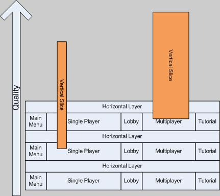

<!-- BEGIN ARISE ------------------------------
Title:: "Corte Vertical vs. Capa Horizontal"

Author:: "Uber Entertainment"
Description:: "Corte Vertical vs. Capa Horizontal"
Language:: "es"
Thumbnail:: "arise-icon.png"
Published Date:: "2009-04-16"
Modified Date:: "2025-10-13"
content_header:: "true"
rss_hide:: "false"
---- END ARISE \\ DO NOT MODIFY THIS LINE ---->

# Corte Vertical vs. Capa Horizontal

> Publicado originalmente en el ahora desaparecido blog uber.typepad.com. Podés encontrar una versión archivada en [The Internet Archive](https://web.archive.org/web/20250914133730/https://uber.typepad.com/birthofagame/2009/04/vertical-slice-vs-horizontal-layer.html)

Ya [lo mencioné antes](../find-the-fun) [(archivo)](https://web.archive.org/web/20250914133730/https://uber.typepad.com/birthofagame/2008/10/find-the-fun-fi.html) — creo que la Vertical Slice (VS) es una de las prácticas de la industria más abusadas. Por definición, debería ser una versión de tu software que esté cerca de la calidad final en un pequeño subconjunto de su dominio que represente el producto global. Si estás haciendo Call of Duty 4, podría ser "sólo una misión" completa, con enemigos controlados por IA funcionando, arte de HUD, esquema de control pulido, cinemáticas dentro de la misión, y recursos de arte de calidad casi final. El problema es que llegar a esta vertical slice en realidad requiere completar una porción enorme del juego. Por ejemplo, el subconjunto de rigs y animaciones de personajes requerido para el nivel puede ser el 80% de las animaciones necesarias para todo el juego. La UI y el HUD son una cantidad de trabajo a menudo subestimada, y aún así, tener versiones de calidad casi final de ellos para "sólo una misión" es decir que ese subsistema entero necesita estar casi completo. Los requisitos pueden decir 3 armas de las 15 que habrá en el juego, pero vas a estar haciendo más de 1/5 del código subyacente para cumplir esos requisitos. Si se emplea demasiado temprano en el desarrollo, la VS puede descarrilar un proyecto entero o, peor, ponerlo en la vía rápida hacia ninguna parte.

Entonces, ¿cuándo es el momento apropiado para construir una Vertical Slice? Yo digo que después de que estén completas las primeras iteraciones de Horizontal Layer. ¿Qué es una Horizontal Layer? Me alegra que preguntes. Cuando prototipamos en Uber, prototipamos el juego entero de principio a fin. Esto incluye single player, multiplayer, menús principales, pantallas de opciones, cinemáticas, briefing de misiones, etc. Cuando toda la experiencia está dispuesta en forma de whitebox, es decir con recursos de arte temporales y muy probablemente código temporal, lo llamamos una Horizontal Layer (HL). Esto nos da el mejor sentido del trabajo real requerido para completar el juego, y la iteración sobre la HL crea un caldo de cultivo de creatividad, ya que probar ideas nuevas es rápido y barato.

Ahora, vos y yo sabemos bien que en el mundo real suele haber restricciones y fuerzas externas que resultan en que se emprenda una VS antes de que todo el juego haya sido cubierto con HLs. Esto puede funcionar, sin embargo, si está bien planificado y hay al menos un par de iteraciones de HL dispuestas en el área específica a la que apunta la VS. De hecho, esto es exactamente lo que hicimos recientemente en nuestro proyecto actual. Construimos una HL para sólo la experiencia central de multiplayer, y después de varias iteraciones sobre eso, decidimos ir por una VS con un subconjunto del contenido. Esto nos permitió armar un video de gameplay realmente increíble que mostramos, en privado, en la GDC.

Mi diagram-fu se debilita cuando trabajo con el track-pad de mi notebook, pero el diagrama de abajo igual sirve para ilustrar algunos puntos clave.

Primero, los componentes del juego (Single Player, Tutorial, etc.) difieren en la cantidad de trabajo y por eso están representados por bloques de distintos anchos. A medida que cada HL se completa, la calidad sube. La VS se asienta sobre la HL y por lo tanto es elevada en calidad por ella. En este diagrama se crean dos vertical slices para dos porciones diferentes del juego; single player y multiplayer. Podés ver que las slices en sí tienen distintos anchos. Esto representa cuánto del componente la VS pretende demostrar. Por ejemplo, la VS de single player puede estar mostrando sólo una porción de una misión de la campaña, mientras que la VS de multiplayer podría demostrar gameplay casi completamente funcional en una variedad de mapas. Notá también que cada slice se empezó durante una iteración diferente de HL. Si la VS de single player hubiera empezado en la tercera iteración de HL, habría alcanzado un nivel de calidad más alto.

Nuestro foco ahora está en colocar Horizontal Layers para el resto del juego, lo que puede dividirse en varios segmentos distintos. Después de iterar sobre estas capas varias veces, iremos vertical, posiblemente sobre múltiples a la vez.

Para resumir, la Vertical Slice es una herramienta útil cuando se emplea de manera controlada en el momento correcto para el software, pero puede ser desastrosa si se ejecuta en condiciones contrarias. Acá va una regla práctica: **Iterá sobre una Horizontal Layer que cubra las áreas deseadas del juego al menos 3 veces antes de emprender la Vertical Slice**.